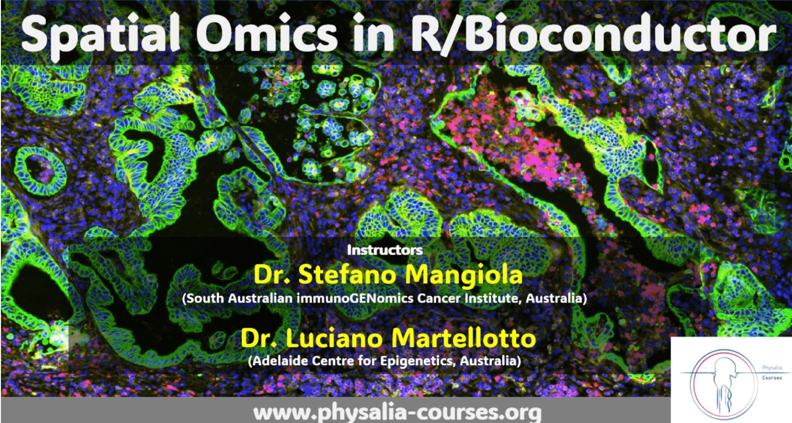

# tidySpatialWorkshop

<!-- badges: start -->
[](https://zenodo.org/badge/latestdoi/379767139)
[](https://github.com/tidyomics/tidySpatialWorkshop/actions/workflows/basic_checks.yaml)
<!-- badges: end -->

## Instructor names and contact information

* Stefano Mangiola <stefano.mangiola at adelaide.edu.au>
* Malvica Kharbanda <malvika.kharbanda at adelaide.edu.au>

## Syllabus

Material [web page](https://tidyomics.github.io/tidySpatialWorkshop/)

More details on the workshop are below.

## Workshop partner: Physalia

<figure>

<figcaption aria-hidden="true"></figcaption>
</figure>

## Workshop package installation 

If you want to install the packages and material post-workshop, the
instructions are below. The workshop is designed for R `4.4` and
Bioconductor 3.19. 

```

# Install workshop package
#install.packages('remotes')
remotes::install_github("tidyomics/tidySpatialWorkshop", dependencies = TRUE)

# Then build the vignettes
remotes::install_github("tidyomics/tidySpatialWorkshop", build_vignettes = TRUE, force=TRUE)

# To view vignette
library(tidySpatialWorkshop)
vignette("Session_1_sequencing_assays")
```

## Interactive execution of the vignettes

From command line, and enter the tidySpatialWorkshop directory.

```
# Open the command line
git clone git@github.com:tidyomics/tidySpatialWorkshop.git

```

Alternatively download the [git zipped package](https://github.com/tidyomics/tidySpatialWorkshop/archive/refs/heads/devel.zip). Uncompress it. And enter the directory. 


To run the code, you could then copy and paste the code from the workshop vignette or 
[R markdown file](https://github.com/tidyomics/tidySpatialWorkshop/blob/devel/vignettes/Session_1_sequencing_assays.Rmd)
into a new R Markdown file on your computer. 

## Workshop Description

This workshop aims to equip participants with a foundational understanding of spatial omics, exploring its significant technologies, applications, and the distinction between imaging and sequencing approaches. We'll begin with a welcome session, outlining the objectives and structure for the day. The content will delve into the basics of spatial omics, discussing its relevance in modern biology and its impact on scientific research. We'll then compare various spatial omics technologies, focusing on the differences and practical considerations between imaging-based and sequencing-based methodologies.

Further, we'll examine detailed sequencing techniques, experimental design, and data analysis challenges, providing insights into effective problem-solving strategies. An overview of analysis frameworks, including principles of 'tidy' data in spatial omics, will also be covered. The workshop will conclude with a summary of key takeaways and a Q&A session, ensuring participants leave with a comprehensive understanding of spatial omics. This session promises to be insightful, offering valuable knowledge for attendees to apply in their research fields.

### Pre-requisites

* Basic familiarity with R
* Basic familiarity with tidyverse
* Basic familiarity with transcriptomic analyses

### Workshop Participation

The workshop format is 3 days with 3 hour sessions consisting of introduction of the experimental techniques, and hands-on
demos, exercises and Q&A. 

### _R_ / _Bioconductor_ packages used

* SpatialExperiment
* MoleculeExperiment

* SubcellularSpatialData
* ExperimentHub
* spatialLIBD
* CuratedAtlasQueryR

* tidyverse
* tidySpatialExperiment
* tidySummarizedExperiment
* tidybulk

* scater
* scran
* scuttle
* Seurat

* SPOTlight
* Banksy
* hoodscanR


### Workshop goals and objectives

Provide a foundational understanding of spatial omics, covering different technologies and the distinctions between imaging and
sequencing in experimental and analytical contexts. This with a focus on the tidy R paradigm and tidyomics.


